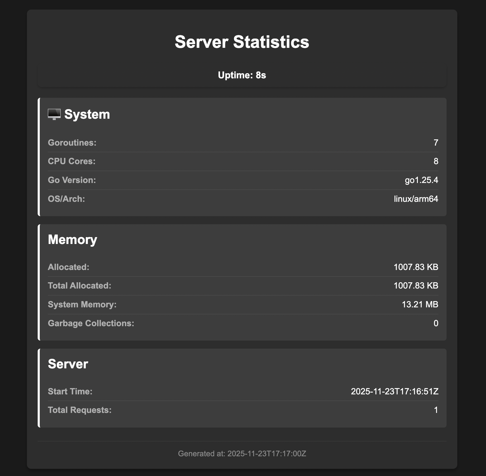

# PR Reviewer Assignment Service

Микросервис для автоматического назначения ревьюверов на Pull Request’ы с управлением командами, активностью пользователей и поддержкой переназначения ревьюверов.

---

## Основные возможности

- **Работа с pr и конмадами** — сооздание конмад, создание pr с автоматическим назначением проверяющих, замена одного ревьювера на другого из его команды, MERGE, корректировка активности юрезров
- **Восстановление после сбоев** — все операции — транзакционные, с retry-логикой для `SERIALIZABLE`  
- **Быстрое тестирование и deploy**: интеграционные тесты через testcontainers-go для всего пакета storage, E2E-тесты через `curl`, поднятие через docker-compose
- **Статистика**: о числе запросов к серивсу и общем стостоянии машины 

---

### Инфраструктура

- **Docker** — контейнеризация всех сервисов
- **Docker Compose** — оркестрация: Go-бэкенд, PostgreSQL, Caddy

---

## Архитектура

- **Архитектурный стиль** — взаимодействие через REST API
- **Модульная структура**: `handlers`, `services`, `storage` — разделение ответственности для удобства тестирования, поддержки и понимания кода
- **Долговременное хранение**: PostgreSQL с индексами, все состанвые мутации выполняются в транзакциях 
- **Caddy**: выступает обратным прокси с JSON-логированием, сжатием ответов и обработкой ошибок.

---

## API

| Эндпоинт                          | Метод | Описание                                      |
|-----------------------------------|-------|------------------------------------------------|
| `/team/add`                       | POST  | Создаёт команду с участниками                  |
| `/team/get`                       | GET   | Возвращает команду с участниками               |
| `/users/setIsActive`              | POST  | Устанавливает флаг активности пользователя     |
| `/users/getReview`                | GET   | Возвращает список PR’ов, где пользователь — ревьювер |
| `/pullRequest/create`             | POST  | Создаёт PR и назначает ревьюверов              |
| `/pullRequest/merge`              | POST  | Помечает PR как `MERGED` (идемпотентно)        |
| `/pullRequest/reassign`           | POST  | Переназначает одного ревьювера на другого      |
| `/stat/json`              | GET  |Запрос статистики в json формате     |
| `/stat/html`           | GET  | Просмотр статистики в html* формате   |

*Фото ниже

----

## Запуск
```bash
docker compose up --build 
```

В реальном проекте нельзя отправлять .env файл на сервер, надо прописывать cp .env.example .env 

----

## Тестирование
```bash
make e2e 

make test 
```

----

## Миграции
```bash
# запускаем постгрес
docker compose up postgres -d

# Применить все миграции
docker compose run --rm migrate up

# Посмотреть статус
docker compose run --rm migrate status

# Откатить последнюю миграцию
docker compose run --rm migrate down

# Откатить до конкретной версии (например, 1)
docker compose run --rm migrate down 1

# Сбросить всё (down всех миграций)
docker compose run --rm migrate reset

# Узнать текущую версию
docker compose run --rm migrate version

```

----

## Сетевые логи
```bash
docker logs -f subscription-budget-caddy-1
```

---

## Скриншоты
 
<div align="center">

### Статистика 
  

</div>
